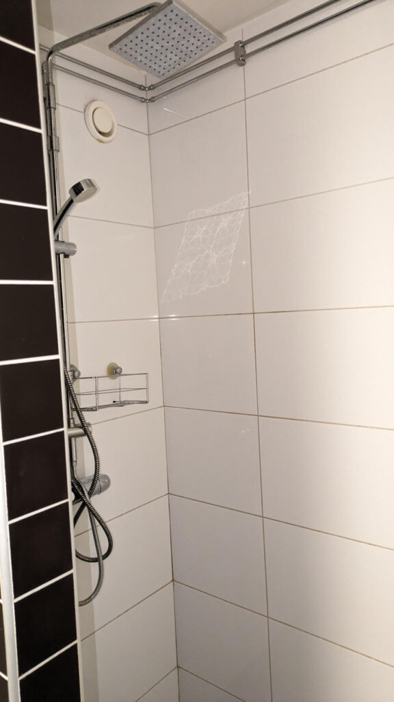

# Bastu

En bastu finns på bottenplan i hus 8. Utöver bastu finns en dusch, toalett och plats för att klä om och vila.

Du bokar bastu via bokningstavlan utanför tvättstugorna eller innanför portarna.

Från och med 2023-12-01 tillkommer en avgift på 25 kr per besök. Kostnaden läggs på din vanliga avgifts-avi (sker i efterhand en gång per kvartal).

De som nyttjar bastun ansvarar för att det lämnas snyggt efter nyttjande.

