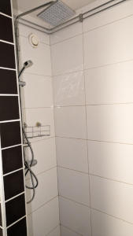
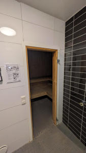
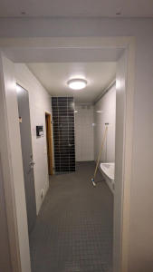
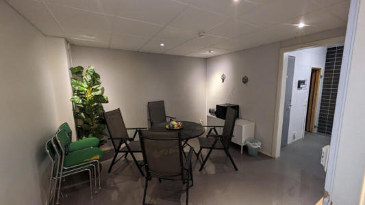

# Bastu

En bastu finns på bottenplan i hus 8. Utöver bastu finns en dusch, toalett och plats för att klä om och vila.

Du bokar bastu via bokningstavlan utanför tvättstugorna eller innanför portarna.

Under 2024 gjordes ett försök med en avgift på 25 kr per besök men det visade sig vara för kostsamt att lägga det på avin. Fr.o.m. 1 juni är det avgiftsfritt att använda bastun.

De som nyttjar bastun ansvarar för att det lämnas snyggt efter nyttjande.

