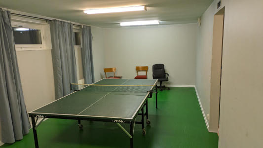
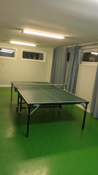
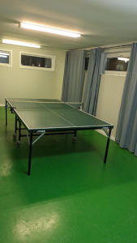

# Bordtennis

Du hittar ett bordtennisbord på bottenplan i hus 8.

I rummet finns ett pingisbord; racket och bollar medtagas av var och en.

De som nyttjar pingisrummet ansvarar för att det lämnas snyggt efter nyttjande. Kom ihåg att stänga eventuella fönster efter er!

---

*Sidan uppdaterad: 2026-10-01*
