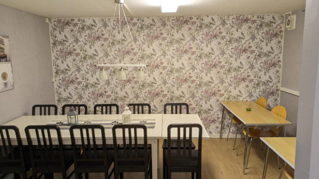
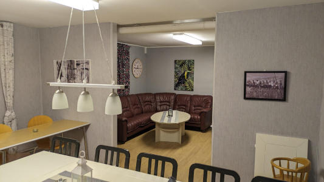
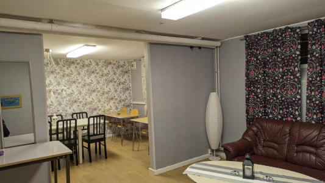
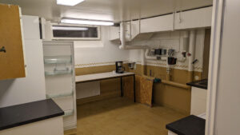
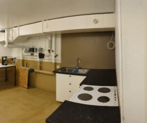
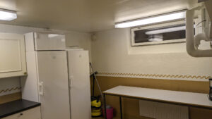

# Festlokal

I föreningen finns en festlokal att hyra. I anslutning finns ett kök med fullstor kyl/frys, spis, kaffebryggare, diskho och plats för att bereda mat.

Glas, kaffemuggar, bestick finns för 20 personer.

Lokalen består av två delar, med plats för 14 stolar i ena och en 5-sits soffa i den andra.

Hyran för lokalen är 150 kr per dag.

Det finns en fysisk nyckel till lokalen så du behöver höra av dig någon/-ra dagar i förväg så att du kan få nyckeln. Vi får ingen notifiering per automatik när någon bokar så man får kontakta styrelsen via telefon eller mail. Lokalen får disponeras från klockan 12.00 till 11.59 dagen därpå.

Kom ihåg att städa lokalen efter er, om där inte är städad tillkommer en avgift för detta. Det skall vara rent och snyggt för nästa besökande.

