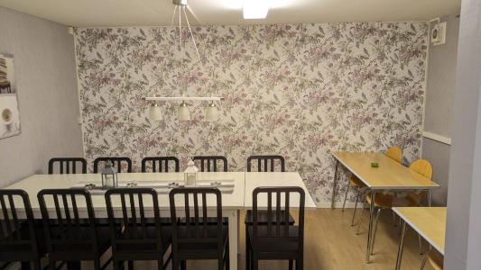
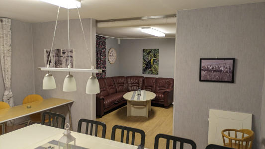
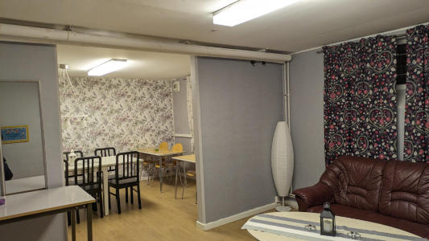
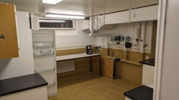
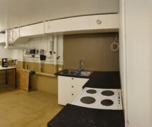
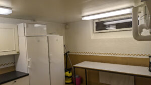

# Föreningslokal

I föreningen finns en Föreningslokal att låna. I anslutning finns ett kök med fullstor kyl/frys, spis, kaffebryggare, diskho och plats för att bereda mat.

Glas, kaffemuggar, bestick finns för 20 personer.

Lokalen består av två delar, med plats för 14 stolar i ena och en 5-sits soffa i den andra.

Lokalen kan bokas via hemsidan eller via tagläsaren utanför lokalen.

Kom ihåg att städa lokalen efter er, om det inte är städad tillkommer en avgift för detta. Det skall vara rent och snyggt för nästa besökande.

---

*Sidan uppdaterad: 2026-10-01*
