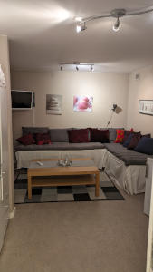
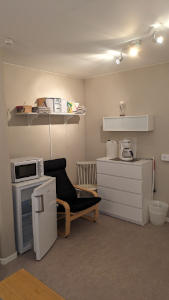
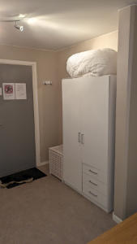

# Gästrum

Gästrummet ligger på bottenvåningen på hus 8.

## Utrustning

Rummet har plats för 1-2 personer. I rummet finns en dubbelsäng och TV.

Rummet får disponeras från klockan 12.00 på ankomstdagen till 11.59 på avresedagen.

Den som hyr rummet behöver ta med sig egna sängkläder och handdukar. Kuddar och täcken finns men det finns inga lakan, örngott och påslakan.

## Boka gästrummet

Gästrummet kan bokas från informationstavlorna i alla portar eller via internet.

Det finns en toalett i anslutning till rummet. Dusch finns i bastun, som du kan boka separat (bastun har normalt en avgift på 25 kr men den betalar man inte när man använder bastun i samband med en bokning av gästrummet).

För en guide om hur du bokar kan du gå in på sidan om tvättstugan.

Rummet får hyras i upp till två veckor. Rummet får hyras flera gånger per år.

Hyran för rummet är 100 kr per natt. Kom ihåg att städa rummet efter er, om rummet inte är städad tillkommer en avgift för detta. Det skall vara rent och snyggt för nästa gäst som kommer.

## Checka in

Det sitter en taggläsaren på dörren, du kommer in med din vanliga tagg på de tider du har bokat gästrummet.

## Checka ut

När det är dags att checka ut vill vi att du skickar ett meddelande via sms/mail/telefonsamtal till vicevärden. Då kan någon ur styrelsen gå in i efterhand och kontrollera städningen.

## Betala

Vi lämnar en faktura för ert besök i din postlåda i samband med att du checkar ut. Du kan betala antingen via Swish eller kontant. Vi lämnar ett kvitto via postlådan när vi har registrerat betalningen.
