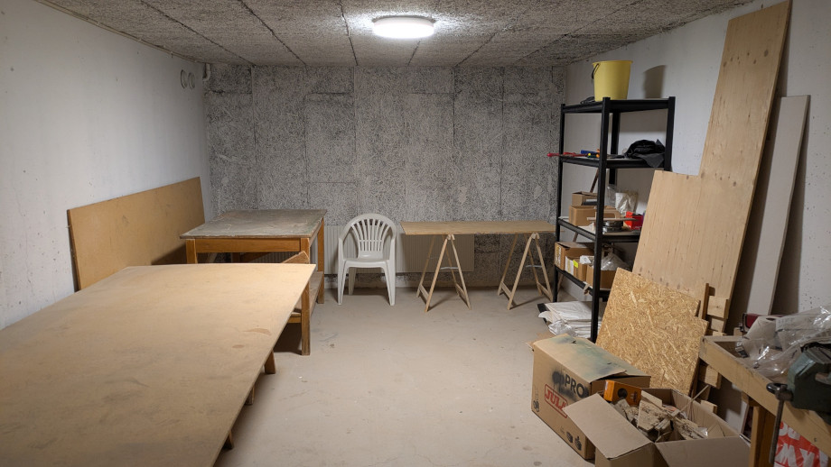

# Hobbyrum

Det finns ett hobbyrum i hus 16, ett litet utrymme på 21 kvm på källarplan man kan använda om man behöver snickra/måla eller liknande.

Man får låna lokalen 2 veckor åt gången men om det inte är någon annan i kö kan man förlänga lånetiden.

Ingen kostnad tillkommer.

Rummet är spartanskt inrett men det finns
- el (1-fas)
- avlastningshylla
- tre arbetsbockar
- en snickarbänk
- ett större bord

Hör av er till styrelsen om ni vill låna nycklar.

---

*Sidan senast kontrollerad och uppdaterad: 2025-08-02*